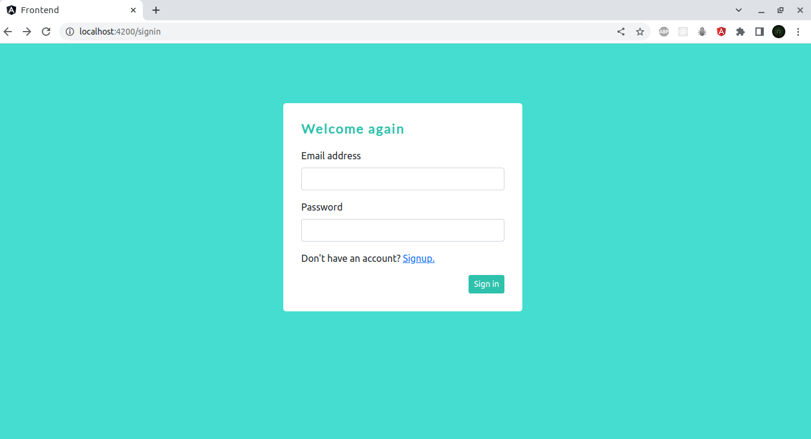
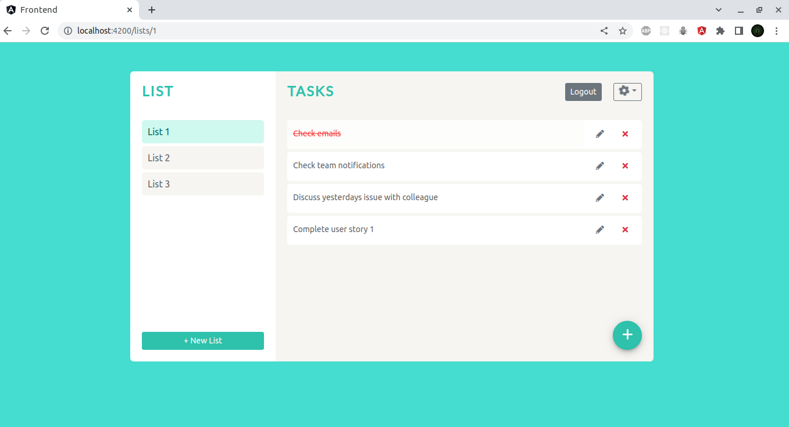

# Task Manager

**`Task Manager`** is a web application developed using **MEAN** stack technologies that helps you to stay organized and manage your day to day work.

## Build with

- Angular
- Bootstrap
- Express
- MongoDB Atlas
- Node
- JSON Web Token

## Getting Started

1. Install NPM packages for api:

   ```sh
   $ cd api
   $ npm install
   ```

2. Install NPM packages for frontend:

   ```sh
   $ cd frontend
   $ npm install
   ```

3. Add necessary key for MongoDB atlas

4. Run api:

   ```sh
   $ cd api
   $ node app.js
   ```

5. Run frontend
   ```sh
   $ cd frontend
   $ npm start
   ```

## Features

- Sign in, Sign up with validation
- Create list
- Create task
- Edit and delete list
- Edit and delete task
- Mark task as completed

## Project preview

<br/><br/>


